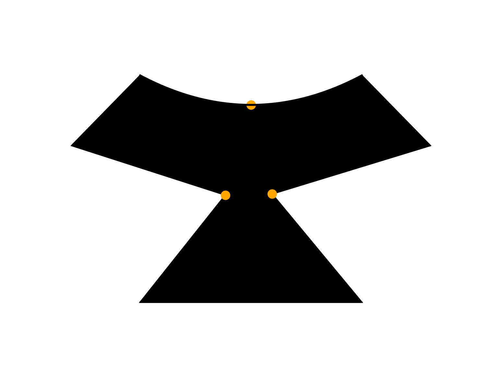

# Silhouette Generator

<p align="center">
    
</p>

## Description

This program generates random black on white silhouettes. It also indicates points of maximum
curvature on the boundary of the silhouette.

Currently, triplets of points are randomly generated from a unit circle. The triplets describe what is presumably a quadratic curve with the middle point being the point of maximum curvature. For the time being all middle points are points of concavity.

There's a couple of adjustments coming (time permitting)
- Allow points of convexity
- Use quadratic bezier curves instead of parametric splines
- Neater code

Not all outputs are 'neat' --  very rarely, curves will intersect.

## Installation

```sh
$ make all
```

## Usage

```sh
Usage: python script.py <number_of_images> <number_of_points> <output_directory>
```
e.g.
```
$ python3 main.py 10 10 out 
```

## Contributing

Contributions are welcome! If you would like to contribute please follow these steps:

1. Fork the repository
2. Create a new branch
3. Make your changes
4. Submit a pull request

## License

This project is licensed under the [Apache License](LICENSE).
